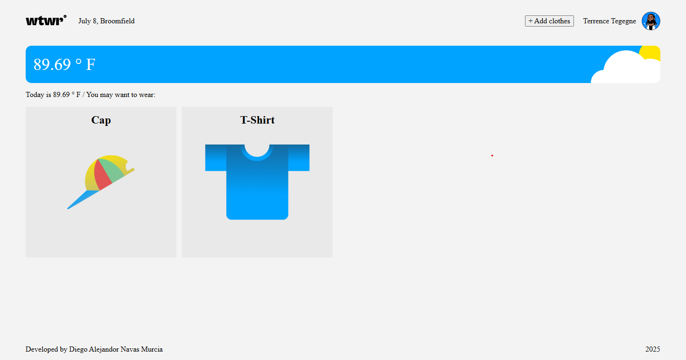
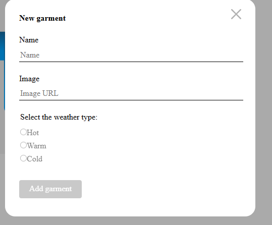
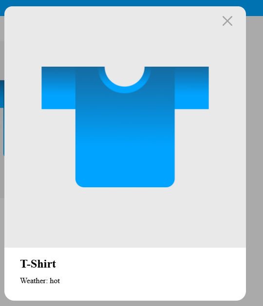

# Weather Closet

A React application that helps users decide what to wear based on the weather conditions of their current city. Users can add garments with images and associate them with weather types (hot, warm, cold), preview them, and enjoy a responsive interface.

---

## Description

This app fetches live weather data from an external API and displays it in the header. Based on the weather, users can manage a wardrobe of garments suitable for different temperatures. The app supports adding new garments, viewing details in modals, and has a clean UI with reusable components.

---

## Technologies & Techniques Used

- **React** with hooks (`useState`, `useEffect`) for state and lifecycle management
- **Modular component architecture** for scalability and reuse
- **Fetch API** to get weather data asynchronously
- **Conditional rendering** for modals and dynamic UI states
- **CSS for styling**, following BEM methodology
- **Controlled and uncontrolled form inputs**
- **Best practices** in import organization and file naming conventions

---

## Features

- Real-time weather data fetching
- Add new garments with name, image URL, and weather tag
- Modal previews for garments
- Responsive and accessible UI
- Clean code structure with grouped imports and reusable components

---

## Screenshots

### Main page with weather and garments list



### Modal to add a new garment



### Garment preview modal



## Installation & Usage

1. Clone the repo:

   ```bash
   git clone https://github.com/diegomur09/se_project_react.git

   ```

2. Intall dependencies:
   bash
   npm install

   ```

   ```

3. Set your weather API key and coordinates in src/utils/constants.js
   export const coordinates = { latitude: 40.7128, longitude: -74.006 };
   export const APIkey = "your-api-key-here";

4. Start the app:
   npm start

# React + Vite

This template provides a minimal setup to get React working in Vite with HMR and some ESLint rules.

Currently, two official plugins are available:

- [@vitejs/plugin-react](https://github.com/vitejs/vite-plugin-react/blob/main/packages/plugin-react/README.md) uses [Babel](https://babeljs.io/) for Fast Refresh
- [@vitejs/plugin-react-swc](https://github.com/vitejs/vite-plugin-react-swc) uses [SWC](https://swc.rs/) for Fast Refresh
